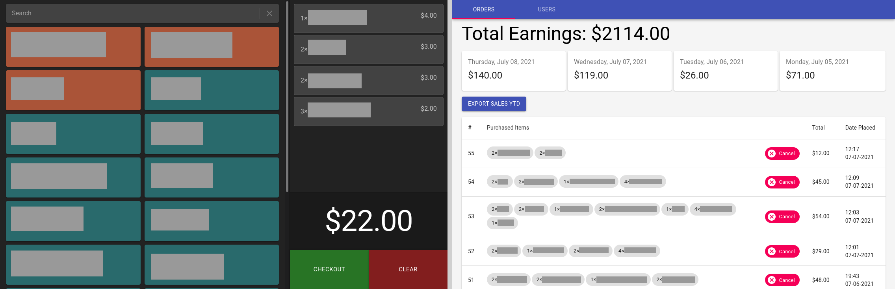
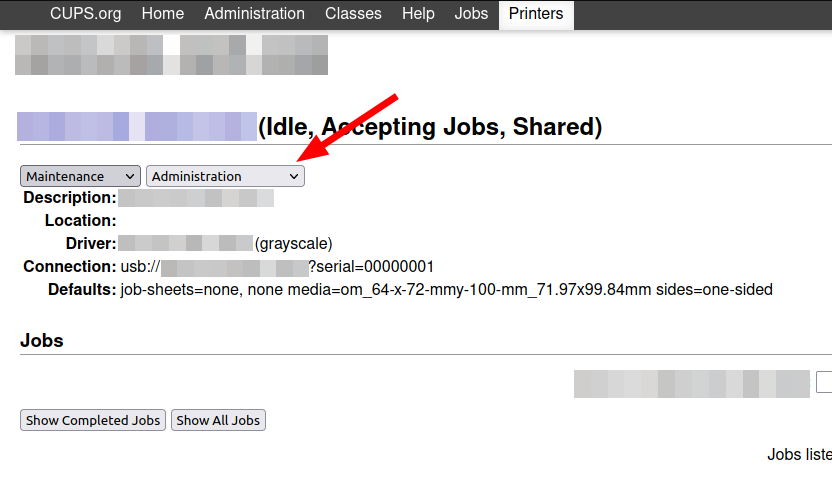

# Point-of-Sale App



This point-of-sale (POS) app, with its administrative panel, was meant to be a simple to use alternative to all the restrictive paid apps for small shops, street fairs, and neighborhood festivals. My goal is to slowly build this into a WordPress for point of sales apps.

## Building

This app was built with Go 1.18, so make sure you have that installed.

``` sh
git clone https://github.com/wisepythagoras/pos-system && cd pos-system
make current_arch
```

If the build completes without any issues, you should have an executable file in `./bin`. Also, create a config based on `config.example.yaml` and then run:

```
./bin/pos-system
```

Then build the front end apps:

``` sh
yarn build && yarn build-admin
```

Now you can access the POS app via `http://localhost:8088`.

## Runtime Dependencies

The only dependency that this application has is `wkhtmltopdf` (you can find information about it [here](https://wkhtmltopdf.org/)), if you want to be able to print receipts (which you should). The website provides [downloadable](https://wkhtmltopdf.org/downloads.html) packages for many systems. However, if you are using Ubuntu or Debian, you can install it by running the following command:

``` sh
sudo apt install wkhtmltopdf
```

## Deploying

If you wish to deploy the app, you can use a $35 [Raspberry Pi](https://www.raspberrypi.org/products/raspberry-pi-4-model-b/) running [Raspberry Pi OS Lite](https://www.raspberrypi.org/software/operating-systems/#raspberry-pi-os-32-bit) or [Ubuntu Server](https://ubuntu.com/download/raspberry-pi), if you wish to have a 64-bit version.

You can create a dedicated Wi-Fi network and connect the Raspberry Pi directly to the router. After that, you'll have to drop this source directory somewhere (see the [Building] section) and create a `config.yaml` file following the example in `config.example.yaml`. Then direct your tablet(s) to `http://localhost:8088`. That's it!

### Printing

This app was built to use a CUPS server. You can connect your thermal printer to the Raspberry Pi you have this server running on, or to some other machine, and tell the POS app where to find it via the [config file](https://github.com/wisepythagoras/pos-system/blob/main/config.example.yaml#L27-L33).

Make sure that your printer settings are valid. You can check the settings by navifating to to http://your-server-ip:631 and under the "Printers" tab select your printer. From there, click on the second dropdown menu and click on "Set Default Options", as shown in the screenshot below.

<p align="center">
    
</p>

### User Management

There is an admin panel for creating and deleting users, but updating them is not supported at the moment. You can either delete the previous user and re-create one, or update the user record in the database. Simply open `pos.db` with [SQLite Database Browser](https://sqlitebrowser.org/), or any other app that can open sqlite databases, and then click on the "Execute SQL" tab or go to the "Browse" tab and update the record you wish.

### Product Management

You can fully manage your products from the "Products" tab in the admin page, as well as create new ones. However, you also have the flexibility of doing this through the API. The following curl is an example of how to create a new product.

``` sh
curl -X POST http://localhost:8088/api/product -d 'name=Product Name&price=$9.99&type=<ID_OF_PRODUCT_TYPE>' -H 'x-auth-token: YOUR_ADMIN_AUTH_TOKEN'
```

You can create any number of product types/categories via the `PUT` endpoint `/api/product/type`. An admin form for creating and managing these is being built.

### Startup Service

Read [this](/startup/README.md) guide.

## What's missing

1. [x] Receipt printer support.
2. [x] Manage products from the admin panel.
3. [x] Manage users through the admin panel.
4. [x] Allow cashiers to select between multiple printers.
5. [x] Separate app/page for stations to fulfill orders.
6. [ ] Extension/module engine.

## License

Although the license for the source code is GNU GPL v3, I prohibit the use of the code herein for the training of any kind of AI model.

The GNU GPL v3 license excludes the files in `src/components/`, which retain whatever license they come with.
